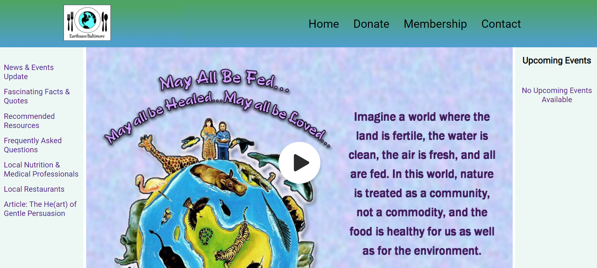
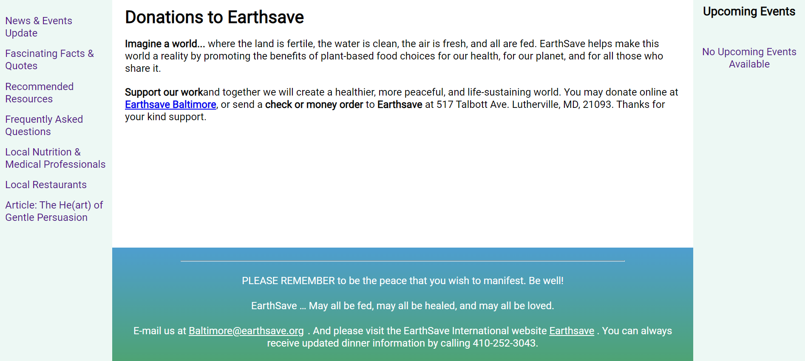

# Earthsave Baltimore

Earthsave Baltimore is a non profit organization promoting healthy eating and
veganism. For this project I used the React JS framework along with different libraries such as sass, react-router-dom, bootstrap, toastify. 

## How To Run This Project

1. Clone project (in terminal add `git clone https:github.com/ChrisDietrich405/earthsave-baltimore`)
2. Install dependencies (in terminal run `npm install`)
3. Run project (in terminal run `npm start`)

Open [http://localhost:3000](http://localhost:3000) to view it in the browser.

The page will reload if you make edits.\
You will also see any lint errors in the console.
## Screenshots 

## IN  ORDER TO UPDATE WEBSITE
 1. npm run build 
 2. open earthsave in window explorer
 -open build folder
 -highlight everything in build folder and compress to zip file
 Now go to Bluehost and go to left side and open Advanced
 scroll down to file manager
 Open up html_public on left side
 Click on Upload (towards the top)
 Drag the compressed file from windows explorer and drop it in Bluehost
 at the bottom in Bluehost there's a button to go back 
 click on Reload (towards the top, but not all the way at the top)
 locate the compressed file in the list of files and highlight it
 towards upper right hand corner click on extract
 click on extract files
 close button click on it